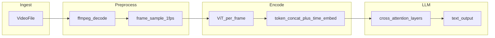
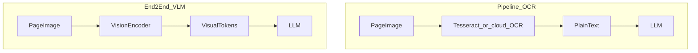
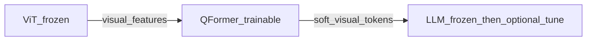
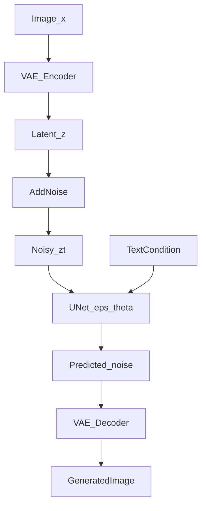
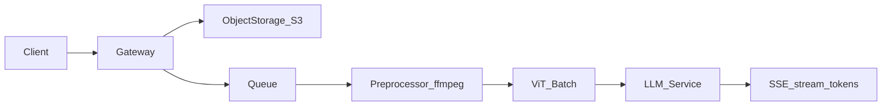
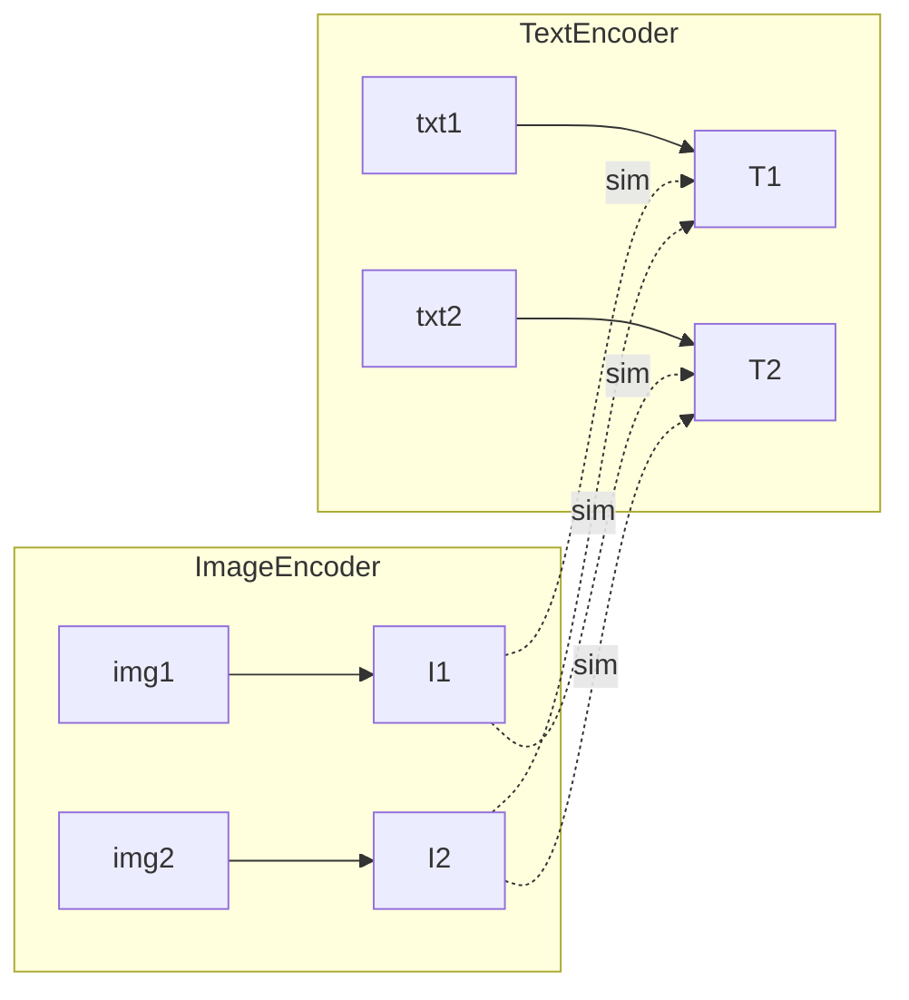

# 多模态大模型期末试卷 · 候选补题库

> 本文档为 `exam_paper.tex` 的**候选补题池**，供审题后择优替换入卷。  
> 现有试卷已覆盖：多模态三要素、CLIP（偏多）、ViT、连接器、融合策略、LDM/DDPM、VQ、M-RoPE、幻觉、Q-Former、系统压轴等。  
> 补题刻意避开与现卷同质重复，按**模态 / 任务 / 架构 / 训练 / 评测 / 工程工具 / 带图交互**等维度组织。

**图例**

| 标记 | 含义 |
|------|------|
| `[选择]` `[填空]` `[解答]` | 题型建议 |
| 难度 | ★ 易 · ★★ 中 · ★★★ 难 |
| 可替换 | 建议可替换的现卷题号（若入选） |
| 📊 | 含 Mermaid 示意图，入 TeX 时可转 TikZ 或插图 |

---

## 一、模态维度

### 1.1 音频（Audio）

#### C-A01 `[选择]` ★★ · 可替换：现卷 Q12（CLIP 温度）

Whisper 将语音转为文本的主流范式是：

- (A) 在梅尔频谱图上训练 CNN 分类器，直接输出汉字类别
- (B) 将音频编码为连续特征序列，再经 Transformer 解码器自回归生成 token 序列（类似 ASR 的 Encoder–Decoder 或 Decoder-only）
- (C) 先将语音 VQ 离散化，再与图像 patch token 拼接做 CLIP 对比学习
- (D) 仅用 ffmpeg 做重采样即可，无需神经网络

**参考答案**：B  
**解析**：Whisper 对 log-Mel 频谱做卷积下采样得到音频特征，再经 Transformer 输出文本 token；属于「音频编码 + 自回归文本生成」范式，与图文 VLM 的连接器思路可类比。

---

#### C-A02 `[填空]` ★ · 可替换：现卷 Q15（CLIP 负样本数）

设语音采样率 16 kHz，Whisper 常用 25 ms 帧移、10 ms 帧长，则每秒梅尔帧数约为 ______ 帧；若 Encoder 下采样倍率为 2，则每秒对应的音频 token 数约为 ______。

**参考答案**：约 100 帧/秒；约 50 token/秒（数量级即可，允许 ±10%）  
**解析**：帧移 10 ms → 100 帧/秒；经卷积 stride 下采样后 token 率减半。考察音频时间分辨率与 token 预算的基本换算。

---

#### C-A03 `[解答]` ★★ · 新增

某流水线需将 mp3 访谈音频送入 Whisper-large 做 ASR，再拼接进 LLM 做摘要。请回答：

1. 列出用 **ffmpeg** 将音频转为 16 kHz 单声道 PCM WAV 的命令（写出关键参数）；
2. 说明为何 ASR 前通常要重采样到 16 kHz，而非直接使用 44.1 kHz 原文件；
3. 若 10 分钟音频 ASR 产出约 2000 文本 token，估算仅文本部分占 LLM 32k 上下文的比例。

**参考要点**：
- `ffmpeg -i input.mp3 -ar 16000 -ac 1 -c:a pcm_s16le output.wav`
- Whisper 在 16 kHz 上训练；过高采样率徒增算力且不提升有效带宽
- 2000/32000 ≈ 6.25%

---

### 1.2 视频（Video）

#### C-V01 `[选择]` ★★ · 可替换：现卷 Q5（融合策略，若保留一题融合即可）

对长视频输入 VLM，下列**最合理**的帧采样与编码策略是：

- (A) 30 fps 全帧送入 ViT，保证时序完整
- (B) 均匀稀疏采样（如 1 fps）+ 每帧独立编码 + 在时间维拼接或加时间位置编码
- (C) 只取首帧，视频等价于图像
- (D) 先将视频转为 GIF 再 OCR

**参考答案**：B  
**解析**：全帧 token 爆炸（10 s × 30 fps × 576 token 量级不可承受）；稀疏采样 + 时序编码是 Video-LLaMA、GPT-4V 视频模式等常见思路。

---

#### C-V02 `[填空]` ★★ · 可替换：现卷 Q16（注意力显存）

一段 60 秒视频以 1 fps 采样，每帧经 ViT 产生 $N_v=256$ 个视觉 token，不做跨帧压缩。则总视觉 token 数为 ______；若 LLM 上下文上限 8192，视觉 token 占比约为 ______（百分数，保留整数）。

**参考答案**：$60 \times 256 = 15360$；约 187%（超出上下文，强调必须压缩或采样）  
**解析**：故意设计为「算完发现放不下」，引导学生思考帧采样、Perceiver 压缩、关键帧选取。

---

#### C-V03 📊 `[选择]` ★★★ · 新增（带图交互）

下图是「视频 → VLM」的一种典型数据流（Mermaid 入卷时可渲染为示意图）：

根据该图，下列说法**错误**的是：

- (A) ffmpeg 负责容器解码与帧提取，不属于 VLM 模型权重的一部分
- (B) 在 Merge 之前，每帧的 ViT 计算可 batch 化以提高 GPU 利用率
- (C) 时序信息必须在 Merge 阶段通过时间位置编码或额外时间 token 注入
- (D) cross_attention_layers 只能出现在 LLM 的最后一层，否则破坏预训练权重

**参考答案**：D  
**解析**：Flamingo、Video-LLaVA 等可在 LLM 多层插入交叉注意力；D 过于绝对。

---

#### C-V04 `[解答]` ★★★ · 可替换：现卷 Q24 小问之一（系统题拓展）

设计一套「30 秒视频问答」推理方案：原视频 30 fps，允许最大 4096 token 的 multimodal 上下文，其中文本预留 512 token。

1. 给出帧采样率、每帧 token 数、是否使用 Q-Former 压缩的合理配置，并算总视觉 token；
2. 说明 Prefill 阶段视觉编码与 LLM 计算的瓶颈差异；
3. 提出一项可降低首 token 延迟的工程优化（如视觉编码批处理、异步预取等）。

---

### 1.3 文档（Document / OCR / Layout）

#### C-D01 `[选择]` ★★ · 新增

相对于「整页截图 → ViT」的文档理解方案，**Donut / Nougat 类**「无 OCR 端到端」方法的主要特点是：

- (A) 完全不做序列建模，仅用 CNN 池化输出类别
- (B) 将文档页编码为视觉 token 序列，由 Transformer 直接自回归生成 Markdown/LaTeX 文本，跳过独立 OCR 流水线
- (C) 先用 Tesseract OCR，再将纯文本送入 BERT
- (D) 只能处理手写体，不能处理印刷体

**参考答案**：B  
**解析**：Donut (ECCV 2022) 代表 OCR-free document understanding；与 pipeline OCR + LLM 对比是文档模态的重要考点。

---

#### C-D02 `[填空]` ★ · 新增

A4 扫描件 2480×3508 像素，若按 14×14 patch 切分（不设 CLS），patch 数约为 ______；这说明高分辨率文档直接进 ViT 会面临 ______ 问题（填一个词：如「长度爆炸」或「算力/显存」）。

**参考答案**：$(2480/14) \times (3508/14) \approx 177 \times 251 \approx 44{,}427$；长度爆炸 / 显存瓶颈  
**解析**：引导学生联系 AnyRes、滑动窗口、版面分析先切块等工程手段。

---

#### C-D03 📊 `[解答]` ★★ · 新增（带图交互）

下图对比两种文档入模方式：

请比较 pipeA 与 pipeB 在**版式保留**（表格、多栏、公式位置）、**错误传播**、**延迟**三方面的优劣。

**参考要点**：OCR 丢失 2D 结构；OCR 错误会传导；端到端更重但可保留空间信息；pipeline 可拆模块调试。

---

### 1.4 图像（Image — 补盲点，非重复 ViT/CLIP）

#### C-I01 `[选择]` ★★ · 可替换：现卷 Q9（CLIP zero-shot）

Grounding DINO / GLIP 相对于 CLIP 的核心增强是：

- (A) 将检测框与语言短语做细粒度对齐，支持 phrase grounding 与 open-vocabulary detection
- (B) 完全放弃文本，只做无监督聚类
- (C) 只能输出整图分类，不能输出框
- (D) 用 GAN 替代 Transformer

**参考答案**：A  
**解析**：补「定位/接地」任务线，与 CLIP 全局嵌入形成对照。

---

#### C-I02 `[填空]` ★★ · 新增

ControlNet 在 Stable Diffusion 中的作用是：在冻结 U-Net 主干的同时，将 ______ 信息通过零卷积注入解码路径，实现对生成过程的 ______ 控制（填两个词，如「边缘/深度/姿态」「结构/空间」）。

**参考答案**：边缘/深度/姿态等条件（Canny、Depth、OpenPose 等）；结构 / 空间  
**解析**：补生成式多模态控制，与现卷 LDM 概念题互补。

---

## 二、任务维度

#### C-T01 `[选择]` ★ · 可替换：现卷 Q1（三要素，若认为过易）

图文检索（Image-Text Retrieval）与图像描述（Image Captioning）的主要差异是：

- (A) 检索是双塔嵌入相似度排序；描述是解码器自回归生成文本，优化 token 级似然
- (B) 两者训练目标完全相同
- (C) 检索必须用扩散模型；描述必须用 CLIP
- (D) 检索输出连续向量；描述输出图像

**参考答案**：A

---

#### C-T02 `[选择]` ★★ · 新增

Referring Expression Comprehension（REC）任务中，模型输入为「图像 + 自然语言指代表达」，输出通常为：

- (A) 整图分类标签
- (B) 目标边界框或分割掩码
- (C) 另一张生成图像
- (D) 音频波形

**参考答案**：B

---

#### C-T03 `[解答]` ★★ · 新增

对比 VQA（视觉问答）与 Visual Dialogue（多轮视觉对话）在**数据形式**、**上下文建模**、**评测指标**三方面的差异，并各举一例 benchmark。

**参考要点**：VQA 单轮 QA；Dialogue 多轮历史；VQA 用 accuracy，Dialogue 用 BLEU/人工评分等；VQAv2 vs VisDial。

---

## 三、架构维度

#### C-AR01 `[选择]` ★★ · 可替换：现卷 Q2 或 Q12（CLIP 减量）

SigLIP 相对于标准 CLIP 的主要改动是：

- (A) 用 sigmoid 损失替代 softmax InfoNCE，支持更小 batch 且无需全局通信
- (B) 完全去掉图像塔
- (C) 只训练文本塔
- (D) 将图像转为 3D 体素

**参考答案**：A  
**解析**：保留「对比对齐」考点但换切面，避免再考 InfoNCE 公式。

---

#### C-AR02 `[选择]` ★★★ · 新增

下列关于「拼接式 VLM」（LLaVA）与「原生多模态」（Chameleon / 部分统一 tokenizer 模型）的判断，**正确**的是：

- (A) 拼接式通常冻结视觉编码器，用投影层对齐到 LLM 词嵌入空间；原生模型倾向从预训练阶段统一离散或连续 token 流
- (B) 拼接式一定比原生式推理快一个数量级
- (C) 原生多模态无法做图像生成
- (D) 两者训练数据完全相同

**参考答案**：A

---

#### C-AR03 📊 `[选择]` ★★ · 新增（带图交互）

下图概括 BLIP-2 三阶段冻结策略：

阶段一训练 Q-Former 时，典型损失是：

- (A) 图像像素 MSE
- (B) 图文对比 / 图文匹配（ITC、ITM、LM 等组合）
- (C) 强化学习 PPO
- (D) GAN 对抗损失

**参考答案**：B  
**解析**：与现卷 Q-Former 填空互补，考训练目标而非仅 token 数。

---

#### C-AR04 `[解答]` ★★★ · 可替换：现卷 Q23（Q-Former 详解）

Perceiver Resampler（Flamingo）与 Q-Former（BLIP-2）均用可学习 latent query，请对比：

1. 在整体架构中的插入位置；
2. 与 LLM 的接口形式；
3. 为何二者都能缓解「视觉 token 过长」问题（用注意力复杂度说明）。

---

## 四、训练与对齐

#### C-TR01 `[选择]` ★★ · 新增

多模态指令微调数据构造时，「单轮图文对话」样本通常表示为：

- (A) 仅图像二进制，无文本
- (B) `&lt;image&gt;` 占位符 + 人类指令 + 助手回复，训练时对助手 token 计算 loss
- (C) 只对图像像素算 loss
- (D) 必须包含负样本对

**参考答案**：B

---

#### C-TR02 `[选择]` ★★★ · 新增

RLHF-V / MM-DPO 等多模态偏好对齐方法，相对于 SFT 的核心增益是：

- (A) 用偏好对（chosen/rejected）优化策略，减轻幻觉、提升有用性与安全性
- (B) 完全不需要视觉编码器
- (C) 只能用于 TTS
- (D) 与 DPO 无关

**参考答案**：A  
**解析**：与 train 卷 DPO 呼应，落到多模态场景。

---

#### C-TR03 `[填空]` ★★ · 新增

LLaVA 阶段一常冻结 ViT 与 LLM，只训练投影矩阵 $W$，使 $h_v W \approx h_{\text{text}}$。若视觉特征维度 $d_v=1024$，LLM 词嵌入维度 $d_{\text{LLM}}=4096$，则 $W$ 的形状为 ______；该阶段常用 ______ 损失（填：next-token prediction / 对比损失 等）。

**参考答案**：$1024 \times 4096$；next-token prediction（或 captioning LM loss）

---

#### C-TR04 `[解答]` ★★ · 可替换：现卷 Q22（LLaVA 两阶段）

给定一条 LLaVA 风格训练样本：图像 + 问「图中有几只猫？」答「两只。」。说明：

1. 视觉 token 在序列中的位置；
2. 哪些 token 参与 loss 计算；
3. 为何阶段一常用简单 caption 数据而阶段二用复杂指令数据。

---

## 五、评测与可靠性

#### C-EV01 `[选择]` ★ · 可替换：现卷 Q11（幻觉概念）

POPE 基准主要用于评测 VLM 的：

- (A) 推理速度
- (B) 对象幻觉（对「图中是否存在某物体」的是/否判断准确率）
- (C) 语音识别字错率
- (D) 扩散步数

**参考答案**：B  
**解析**：把幻觉从概念题升级为可测 benchmark。

---

#### C-EV02 `[填空]` ★★ · 新增

MME 评测涵盖感知与认知子项；其中 Perception 侧常包括存在性、计数、颜色等，Cognition 侧包括常识、数学、代码等。若某模型 Perception 高、Cognition 低，可能说明其 ______ 强但 ______ 弱（各填一词）。

**参考答案**：视觉感知 / 视觉接地；高阶推理 / 知识运用（合理即可）

---

#### C-EV03 `[解答]` ★★ · 新增

列举 3 种缓解对象幻觉的方法（训练侧或推理侧均可），并简述机理：如 OPERA、VCD、RLHF 偏好惩罚、提高视觉分辨率等。

---

## 六、生成与编辑（扩散之外 & 深化）

#### C-GEN01 `[选择]` ★★ · 可替换：现卷 Q6（LDM 概念，保留一题扩散即可）

IP-Adapter 实现「参考图风格迁移」的核心思路是：

- (A) 将参考图 CLIP 图像嵌入通过解耦交叉注意力注入 U-Net，无需微调整网
- (B) 重新训练整个 SD 从像素开始
- (C) 仅修改 VAE
- (D) 删除文本条件

**参考答案**：A

---

#### C-GEN02 `[填空]` ★★ · 新增

Classifier-Free Guidance 推理时，条件与无条件得分组合为 $\tilde\epsilon = \epsilon_u + s(\epsilon_c - \epsilon_u)$。$s$ 越大，生成结果通常越 ______ 文本，但过高可能导致 ______（各填一词：如「贴合」「过饱和/多样性下降」）。

**参考答案**：贴合；过饱和 / 多样性下降 / 伪影

---

#### C-GEN03 📊 `[解答]` ★★★ · 新增（参考论文图思路）

Stable Diffusion 论文中的 Latent Diffusion 结构可抽象为：

根据该图回答：

1. 为何在 $z$ 空间而非 $x$ 空间扩散能降低计算量？（从空间分辨率角度）
2. 文本条件通常如何注入 U-Net？（交叉注意力 / AdaGN 等，答出一种即可）
3. VAE 重建误差会对最终生成造成什么影响？

---

## 七、工程与数据处理工具

#### C-EN01 `[选择]` ★ · 新增

在多模态数据预处理流水线中，**ffprobe** 相对于 **ffmpeg** 的主要用途是：

- (A) 仅用于视频转码，不能读取元数据
- (B) 探测媒体文件的编码格式、分辨率、帧率、时长等元信息，常用于入库前校验
- (C) 训练 Transformer 权重
- (D) 替代 CUDA 做矩阵乘

**参考答案**：B

---

#### C-EN02 `[填空]` ★★ · 新增

将 1920×1080 的 mp4 每 2 秒抽一帧保存为 jpg，ffmpeg 命令中抽帧参数常用 `-vf fps=1/2` 或 select 滤镜；若视频长 60 秒，约得到 ______ 张图。若每张经 ViT 得 256 token，总 token 为 ______。

**参考答案**：30 张；$30 \times 256 = 7680$

---

#### C-EN03 `[解答]` ★★ · 新增

设计 LAION 风格图文对的**最小清洗流水线**（文字描述即可），需包含：

1. 图像解码与尺寸过滤（可写 `ffmpeg` / `PIL` / `pyarrow` 等工具角色）；
2. 文本侧过滤（长度、语言、NSFW 关键词）；
3. 图像侧过滤（分辨率、宽高比、模糊检测思路）；
4. 去重策略（感知哈希 / embedding 近邻，二选一说明）。

---

#### C-EN04 `[选择]` ★★ · 新增

Hugging Face `datasets` + `webdataset` 格式在大规模多模态预训练中的优势是：

- (A) 必须将全部数据载入内存
- (B) 支持流式读取 tar shard，适合 PB 级图文对，减少随机小文件 I/O
- (C) 只能存文本
- (D) 与 PyTorch 无关

**参考答案**：B

---

#### C-EN05 📊 `[解答]` ★★★ · 可替换：现卷 Q24（系统压轴备选）

下图是一条在线 VLM 服务数据路径：

某次故障表现为「视频请求 P99 延迟 30s，图片请求正常」。请根据图分析 2 个可能瓶颈，并各给 1 条优化措施。

**参考要点**：视频 decode 阻塞；逐帧 ViT 未 batch；冷启动拉取 S3；可用异步 decode、帧采样、视觉特征缓存等。

---

## 八、带图交互 · 综合设计题（压轴备选）

#### C-Z01 📊 `[解答]` ★★★★ · 可替换：现卷 Q24

**题目：根据架构图回答**

下图融合 LLaVA、BLIP-2、Flamingo 三类设计（教学示意，非单一论文原图）：

```mermaid
flowchart TB
  subgraph pathL [LLaVA_style]
    IL[Image] --> ViTL[ViT]
    ViTL --> Proj[LinearProj]
    Proj --> Cat[Concat_with_text_tokens]
    Cat --> LLML[DecoderOnly_LLM]
  end
  subgraph pathB [BLIP2_style]
    IB[Image] --> ViTB[ViT_frozen]
    ViTB --> QF[QFormer_queries]
    QF --> ProjB[Proj_to_LLM]
    ProjB --> LLMB[LLM]
  end
  subgraph pathF [Flamingo_style]
    IF[Image] --> ViTF[ViT_or_Perceiver]
    ViTF --> GCA[GatedCrossAttn_in_LLM_layers]
    GCA --> LLMF[LLM]
  end
```

1. 比较三条路径中「视觉信息进入 LLM 的接口」差异；
2. 哪种最适合「极长视频 + 短问答」？说明理由；
3. 若 GPU 显存只允许 LLM 侧最多 1024 个 multimodal token，对 pathB 和 pathL 各提出一项配置建议（帧数、$N_v$、$N_q$ 等）。

---

#### C-Z02 📊 `[选择]` ★★★ · 新增（论文图思路 — 对比学习）

「CLIP 双塔 + 对比矩阵」示意：

设 batch=2，$(img1,txt1)$、$(img2,txt2)$ 为正样本。图像到文本方向，$img1$ 的负样本文本是：

- (A) 仅 txt1
- (B) 仅 txt2
- (C) txt1 与 txt2 均为负样本
- (D) 无负样本

**参考答案**：B  
**解析**：比现卷 Q12 更图形化，考点相同但可**替换**而非追加 CLIP 题。

---

## 九、题位替换建议速查表

| 现卷题号 | 现考点 | 重复风险 | 优先候选补题 |
|----------|--------|----------|--------------|
| Q2 | CLIP 机制 | 高 | C-AR01 SigLIP |
| Q9 | CLIP zero-shot | 高 | C-I01 Grounding |
| Q12 | CLIP 温度/负样本 | 高 | C-A01 Whisper / C-Z02 图化 CLIP（二选一） |
| Q14 | InfoNCE 公式 | 高 | C-V02 视频 token 预算 |
| Q15 | 负样本数 | 高 | C-A02 音频帧率 / C-EN02 ffmpeg 抽帧 |
| Q19 | CLIP 推导 | 高 | C-TR04 LLaVA 样本 / C-GEN03 LDM 结构 |
| Q1 | 三要素 | 低 | 可保留 |
| Q3/Q13/Q20 | ViT | 中 | 保留 1 选择 + 1 填空 + 1 解答即可 |
| Q6/Q7/Q17/Q21 | 扩散 | 中 | 保留 2 题 + C-GEN02 CFG 填空 |
| Q11 | 幻觉 | 低 | C-EV01 POPE |
| Q24 | 系统压轴 | — | C-V04 / C-EN05 / C-Z01 |

---

## 十、入卷检查清单（审题用）

- [ ] CLIP 相关 ≤ 3 题（含填空/解答）
- [ ] 至少 1 题音频 / 1 题视频 / 1 题文档
- [ ] 至少 1 题工程工具（ffmpeg / ffprobe / datasets）
- [ ] 至少 1 题带示意图（Mermaid → TikZ/PNG）
- [ ] 至少 1 题 grounding / 检测 / 控制生成
- [ ] 至少 1 题评测 benchmark（POPE / MME 等）
- [ ] 难度：易 8 题 / 中 10 题 / 难 6 题（建议比例）
- [ ] 与 train / inference 卷知识点交叉但不重复整卷风格

---

## 附录：Mermaid 入 TeX 的说明

正式入卷时有三种处理方式：

1. **本地预渲染**：`mmdc -i fig.mmd -o fig.pdf`，`\includegraphics{fig.pdf}`
2. **TikZ 手绘**：简化的数据流图用 TikZ 复刻（train/inference 卷风格）
3. **考点外置**：卷面印简化示意图，题干写「根据下图」—— 与高考物理/化学图题类似

如需，可在确定入选题目后，再为每道 📊 题单独出 `figures/*.mmd` 或 TikZ 源码。
